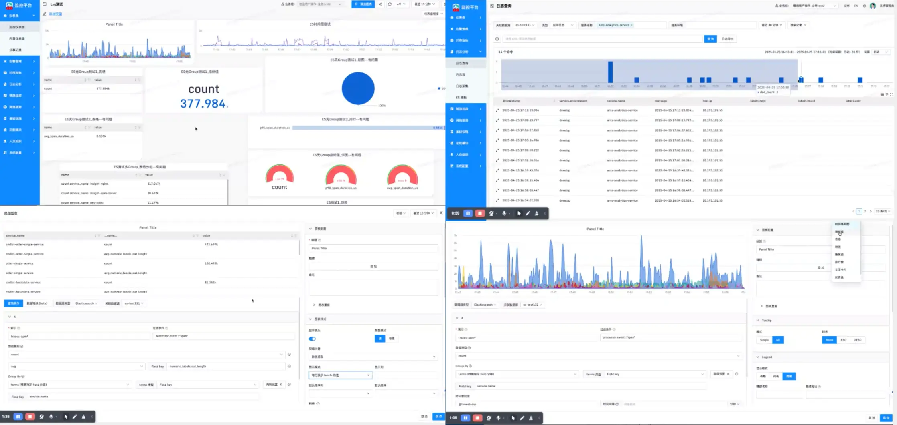

# React Visualization Dashboard

[](https://reactjs.org/)
[](https://www.typescriptlang.org/)
[](https://vitejs.dev/)
[](https://ant.design/)

一个基于 React + TypeScript 的企业级监控平台前端项目，专注于时序指标监控、日志分析与链路追踪等可观测性场景。提供强大的数据可视化能力、灵活的仪表盘配置以及多数据源支持。

## ✨ 核心特性

* 📊 **强大的数据可视化**：基于 `@antv/g2` 和 `@antv/g6`，支持时序图、饼图、柱状图、仪表盘及图关系可视化。
* 🧩 **灵活的仪表盘布局**：集成 `React Grid Layout`，支持拖拽式布局，所见即所得。
* 📝 **智能代码编辑器**：内置基于 `@codemirror 6` 的编辑器，支持 `PromQL` 语法高亮与自动补全。
* 🔌 **多数据源支持**：统一管理 Prometheus、Elasticsearch 等多数据源，支持跨数据源查询。
* 🌐 **国际化支持**：基于 `i18next` 实现完善的中英文切换。
* 🛡️ **类型安全**：全量 TypeScript 编写，提供完整的类型定义与类型推导。

## 🛠 技术栈

### 基础框架

* **UI 框架**: React 17.0
* **类型系统**: TypeScript 5.3
* **路由管理**: React Router DOM 5.2
* **构建工具**: Vite 2.1

### UI & 可视化

* **组件库**: Ant Design 4.21
* **图表引擎**: @antv/g2 5.1, @antv/g6 4.8, D3.js
* **布局库**: React Grid Layout
* **编辑器**: @uiw/react-codemirror (基于 CodeMirror 6)

### 工具 & 状态管理

* **状态管理**: React Hooks Global State, Context API
* **HTTP 请求**: umi-request
* **Hooks 工具**: ahooks
* **工具库**: Lodash, Moment.js, semver

## 📂 目录结构

```bash
src/
├── components/      # 公共组件 (TimeRangePicker, etc.)
├── pages/           # 页面模块
│   ├── dashboard/   # 仪表盘核心模块 (Renderer, Editor, VariableConfig)
│   ├── alertRules/  # 告警规则配置
│   ├── logs/        # 日志分析
│   ├── traces/      # 链路追踪
│   └── ...
├── services/        # API 服务层
├── store/           # 全局状态管理
├── utils/           # 工具函数集合
└── routers/         # 路由配置
```

## 🚀 快速开始

## 📚 核心模块说明

### Dashboard (仪表盘)

项目的核心模块，位于 `src/pages/dashboard/`。

* **List**: 仪表盘列表管理。
* **Detail**: 仪表盘详情与渲染，负责处理变量联动与数据刷新。
* **Editor**: 图表编辑器，集成 PromQL 查询编写与图表样式配置。
* **Renderer**: 图表渲染引擎，负责将查询数据转换为可视化图表。

### Datasource (数据源)

负责对接后端数据接口，支持多种数据源类型（Prometheus, Elasticsearch 等）的连接与查询代理。


